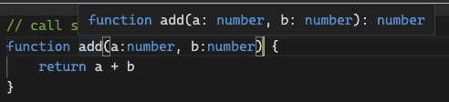

# TypeScript에서 함수

## 함수에 타입을 지정하는 방법

함수는 파라미터와 return 타입을 지정할 수 있습니다.

### 파라미터  및  return type 지정

1. 파라미터 타입 지정: 파라미터 옆에 타입 작성
2. return 타입 지정: 함수명( ) 옆에 타입 작성

```typescript
function HelloUser(name : string) : string{
    return `${name}님 안녕하세요!`
}
```

파라미터가 필수가 아니라면 ? 를 쓰면 됩니다.

? 는 `name: string | undefined` 와 동일한  의미를 지닙니다. (union type 사용 가능)

```typescript
function HelloUser(name? : string) : string{
    if(!name) {
        return `user님 안녕하세요!`
    }
    return `${name}님 안녕하세요!`
}
```

#### 객체의 타입 지정

파라미터나 return값의 타입이 객체일 경우 `type`을 사용하여 객체 타입을 지정한 다음 이를 사용하면 됩니다.

```typescript
type PlayerProps = {
    name: string,
    age?: number,
}

function playerMaker(name : string) : PlayerProps {
    return {
        // name: name을 줄여서 하나로 작성 
        name
    }
}
```

### return 이 없을 때

#### 1) void

함수가 return을 하지 않을 경우에는 void type이라고 합니다. void는 명시적으로 작성하지 않아도 타입 추론을 통해 추론됩니다. 이는 해당 함수를 사용할 때 return 값을 받으려고 할 경우 오류를 알려줍니다.

```typescript
function hello() : void{
    console.log("안녕");
}

function hello(){        // void는 쓰지 않아도 됩니다.
    console.log("안녕");
}
```

#### 2) never

never은 함수가 **절대 return을 하지 않는다**는 의미입니다. 대표적으로 오류를 throw하는 경우가 있습니다 . 또한 조건문에서 가능한 모든 경우를 거친 else에서 사용되는 변수는 type이 never입니다.

```typescript
function hello():never{
    throw new Error("xxx");
}

function hello(name:string|number){
    if(typeof name === "string"){} // 여기서 name은 string 타입 
    else if(typeof name === "number"){} // 여기서 name은 number타입 
    else{} // 여기서 name은 never 타입 
}
```

#### 3) void와 never의 차이 (작성중)


## call signiture

파라미터와  return 타입을 각각 지정하는 대신 type 예약어를 통해 묶어서 정의할 수 있습니다. 이렇게 타입을 지정하면 코드에 마우스를 올렸을 때 정의된 함수의 타입 형태가 가이드로 나와 함수를 사용할 사람에게 가이드를 줄 수 있습니다.&#x20;

```typescript
type AddProps = (a: number, b: number) => number; //return을 하지 않을 경우에는 void

const add:AddProps = (a, b) => a + b;
```

<figure><figcaption></figcaption></figure>

## overloading

typescript에서 overloading이란 call signiture를 여러 개 두어 다양한 type과 상황을 커버할 수 있도록 type을 지정하는 것입니다.

예시1)  b의 타입에 number와 string이 동시에 지정되어 있어, 두 가지 경우 모두 커버할 수 있다.

<pre class="language-ts"><code class="lang-ts"><strong>type Add2 = {
</strong>    (a: number, b: number): number
    (a: number, b: string): number
}

const add5: Add2 = (a, b) => {
    if(typeof b === 'string') return a
    return a + b
}
</code></pre>

예시2) next.js의  라우터: next.js에서 라우터의 경로를 설정할 때, stirng과 객체 형태 모두 사용할 수 있도록 되어있음.

<pre class="language-typescript"><code class="lang-typescript">type ConfigProps = {
    path: string,
    state: object
}

<strong>type PushProps = {
</strong>    (path: string): void
    (config: ConfigProps): void
}

const puch: PushProps = (config) => {
    if(typeof config === "string" ) {console.log(config)}
    else{console.log(config.path)}
}

// 아래 둘 다 가능
Router.push("/home")

Router.push({
    path: "/home",
    state: false
})
</code></pre>

* 파라미터의 일부를 optional로 만듦

```typescript
type AddProps = {
    (a: number, b: number): number
    (a: number, b: number, c: number): number
}

// c는 optional이기에 ?: 표기 필요
const add:AddProps = (a, b, c?: number) => {
    if(c){return a+b+c}
    return a+b;
}
```

## generic type

> generic type은 대문자로 시작합니다 .

typeScript는 generic type을 통해 Polymorphism(다형성)을 표현할 수 있도록 해줍니다. Polymorphism이란 many의 의미를 가진 poly와 structure의 의미를 가진 morphism의 합성어로, 말 그대로 다양한 구조를 가진 형태를 말합니다. 그리고 typeScript에서의 다양한 형태란, 다양한 type을 의미합니다.

즉, concrete type 중 어떤 타입이 어떤 조합으로 들어올 지 모르는 상황에서는 type을 명확하게 정의하는 대신에 generic type을 사용하여 type을 지정합니다. generic type은 typeScript의 타입 추론을 활용하여, 실제 사용할 때 들어오는 argument에 따라 해당 함수의 parameter type과 return type을 통해 타입을 추론하게 하는 방법을 말합니다.

예시를 통해 사용방법과 정의를 알아봅시다.

아래 코드처럼 superPrint에 number\[], boolean\[], string\[] 뿐만 아니라 이들이 섞여있는 배열까지도 무엇이든 들어올 수 있는 경우에 모든 case를 명시적으로 작성하는 것은 불가능합니다.

```typescript
// 이처럼 모든 case를 다 적어줘야 함, 이는 불가능
type SuperPrintProps = {
	(arr: number[]): number
	(arr: string[]): string
	(arr: boolean[]): boolean
	(arr: (number|boolean)[]): (number|boolean)
	(arr: (number|boolean|string)[]): (number|boolean|string)
}

const superPrint: SuperPrintProps = (arr) => arr[0];

const a = superPrint([1,2,3,4]);
const b = superPrint(["a","b","c"]);
const c = superPrint([true, false]);
const d = superPrint([1,2,true]);
const e = superPrint([1,2,true,"a"]);
```

따라서 이런 경우 타입 추론을 하여 상황마다 타입을 정할 수 있도록 generic type을 씁니다. 여기서 T는 대명사로 어떤 단어도 사용할 수 있습니다. 이 T 자리는 사용할 당시 들어오는 argument에 따라 그 타입이 추론되어 들어갈 것입니다.

```typescript
// 앞에 <T> 를 통해 T가 generic type을 사용하는 대명사라는 것을 암시
type SuperPrintProps = <T>(arr: T[]) => T;

const superPrint: SuperPrintProps = (arr) => arr[0];
t
const a = superPrint([1,2,3,4]);
const b = superPrint(["a","b","c"]);
const c = superPrint([true, false]);
const d = superPrint([1,2,true]);
const e = superPrint([1,2,true,"a"]);
```

generic type을 여러 개 사용하고 싶을 땐 <>에 , 로 여러 개를 넣으면 됩니다.

```typescript
// <>에 , 로 여러 개의 generic type을 넣음
type SuperPrintProps = <T, M>(arr: T[], b: M) => T;

const superPrint: SuperPrintProps = (arr, b) => {
	console.log(b);
	return arr[0];
};

const a = superPrint([1,2,3,4], "b");
const b = superPrint(["a","b","c"], 1);
const c = superPrint([true, false], true);
const d = superPrint([1,2,true], "name");
const e = superPrint([1,2,true,"a"], false);
```

일반적으로 generic type은 외부 라이브러리를 사용하거나 , 혹은 만들 때 사용됩니다. 또한 객체의 일부에 type 자유도를 줄 때 generic type를 사용할 수 있습니다. 그러면 객체를 생성할 때 들어가는 데이터를 통해 타입 유추를 하여 type이 결정됩니다. 이러한 속성을 이용해서 더 큰 type을 만들고, 이에 대한 세분화 된 type은 따로 선언하여 type들을 재사용 할 수 있는 모듈로 만들 수 있습니다.

```typescript
type PlayerProps<E> = {
	name: string,
	extraInfo: E //어떤 type의 내용이든 올 수 있음
}

// extraInfo은 string property를 가진 객체

// 2번
type NicoExtraProps = {hobby: string}

const nico: PlayerProps<NicoExtraProps> = { //const nico: PlayerProps<{hobby: string}>
	name: "nico",
	extraInfo: {
		hobby: "swimming",
	}
}

// 3번: extraInfo은 null
const mickey: PlayerProps<null> = {
	name: "nico",
	extraInfo: null,
}
```

generic type은 typescript에서 제공하는 다양한 내장 객체에서도 사용됩니다. 대표적으로 `Array` 객체의 경우 배열 안에 어떤 원소든 들어갈 수 있도록 하기 위해 `Array<T>`로 되어있습니다. 따라서`Array<number>`은 `number[]`와 같습니다.
